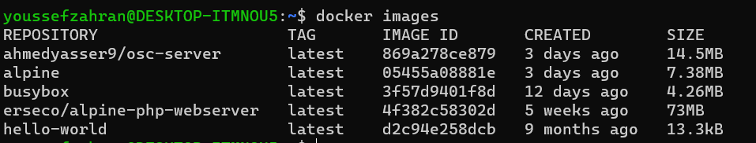
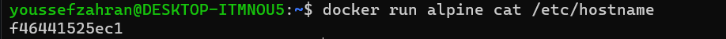
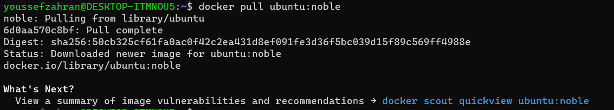
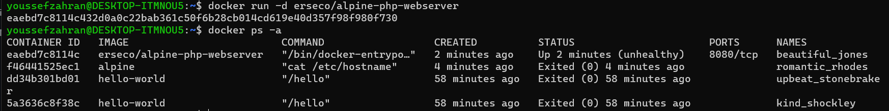
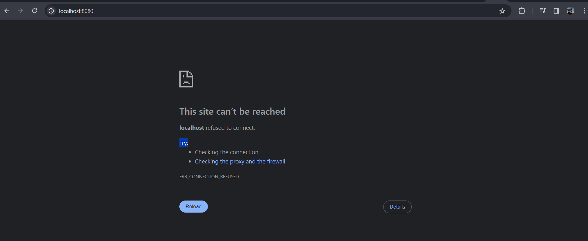
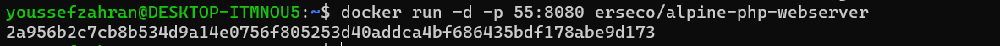
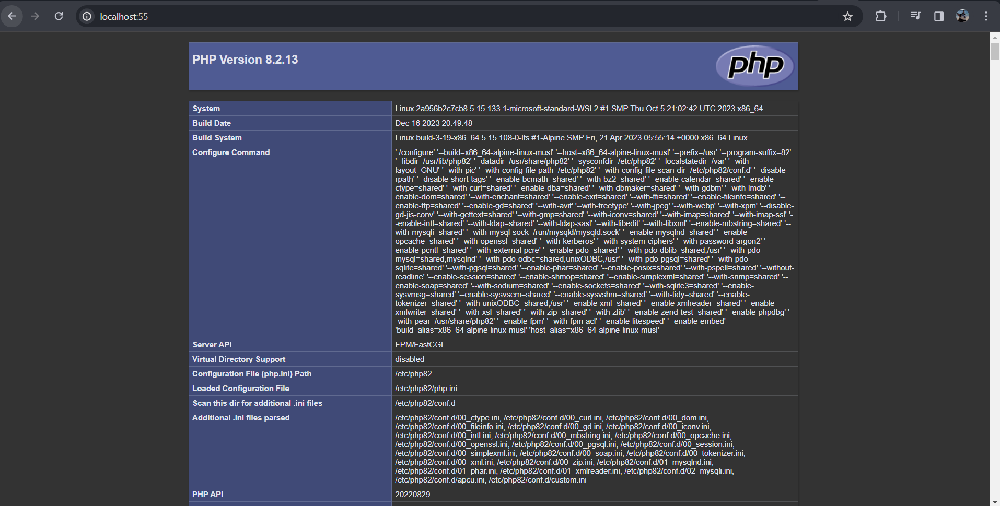
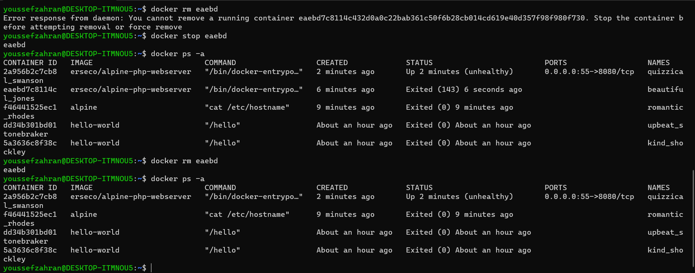

# Session 1 Task:

## Q1 : How many images are downloaded: 

## Q2 : Create a container from Alpine and have it print the content of /etc/hostname file:

## Q3 : Download Ubuntu image with noble tag:

## Q4 : Run a container using erseco/alpine-php-webserver image and detach it:

## Q5 : The above image erseco/alpine-php-webserver is a web server that runs on port 8080, how can we map it to port 55 on our host?:

## Q6 : Take a screenshot of the page that is loaded when visiting localhost:55 after running the container in Q5:

## Q7 : Search for the container you ran in Q4 and stop it then delete it

