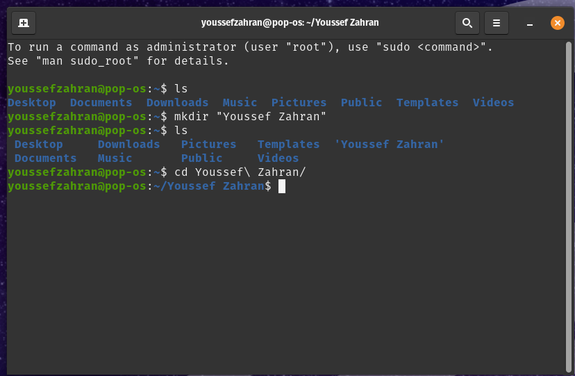
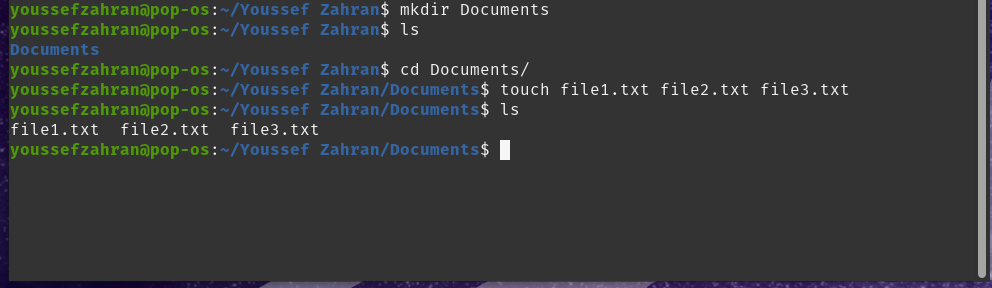
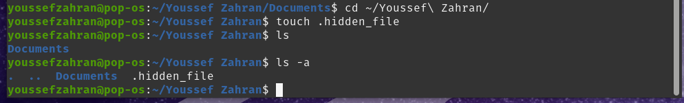
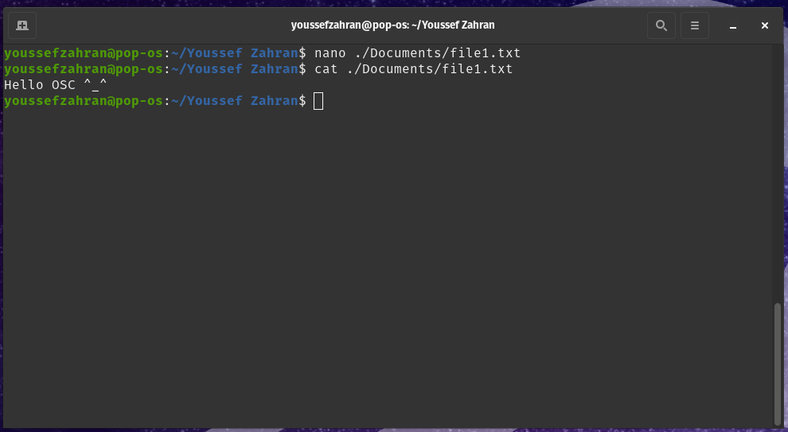
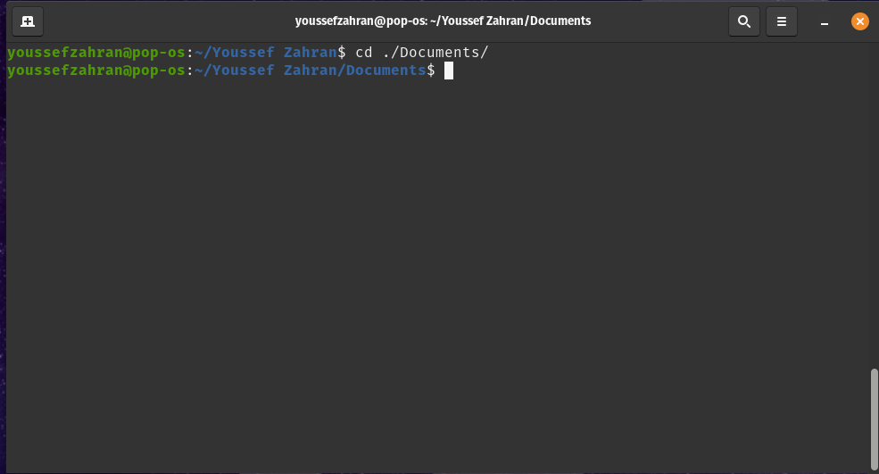
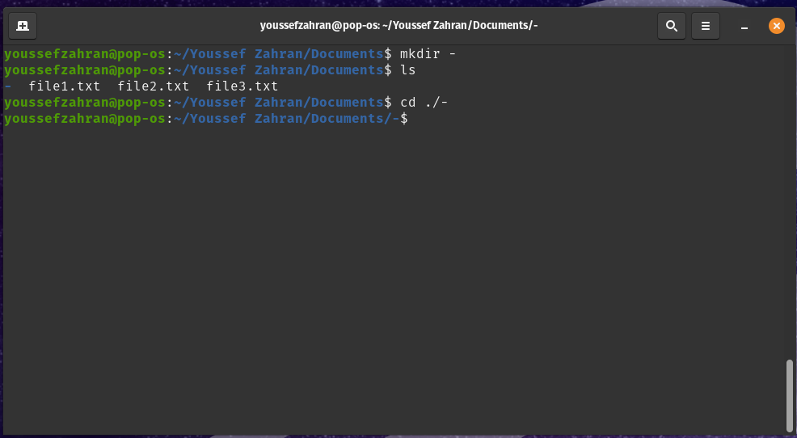
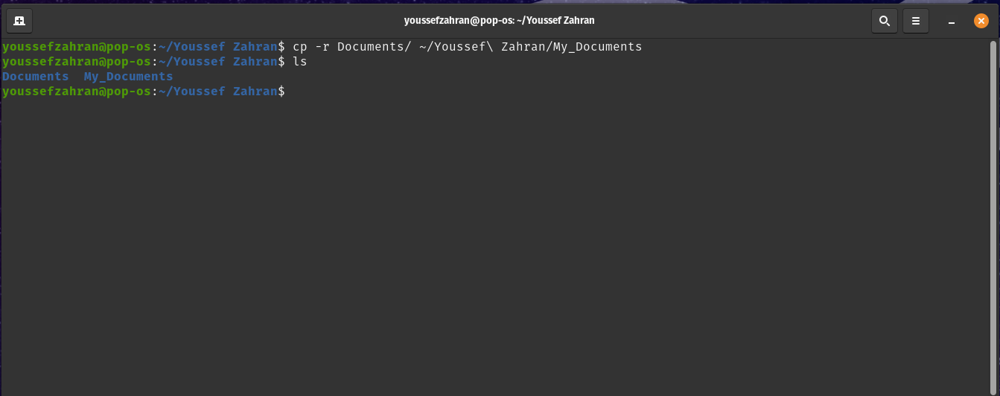
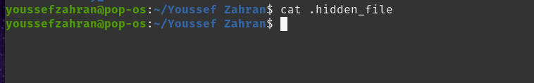
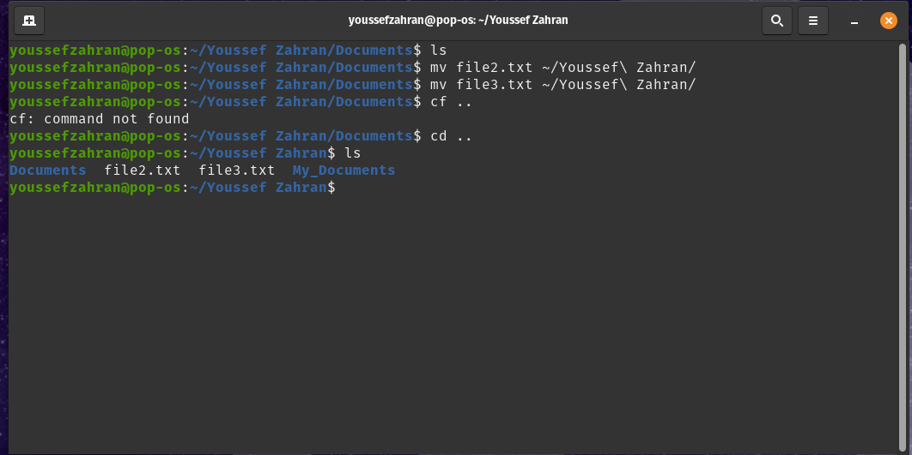
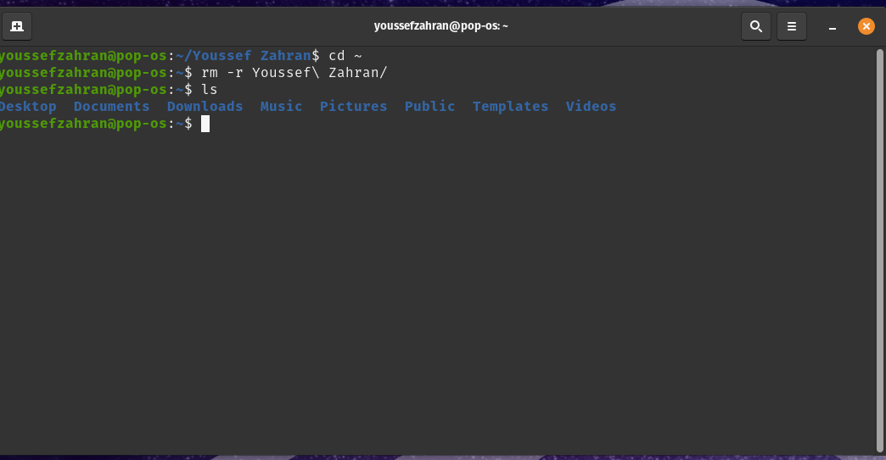

# Session 1 Task:

## Step 1: Creating Directory with my name

## Step 2: Making sub-directory and files in it 

## Step 3: Creating a hidden file 

## Step 4: Writing with nano 

## Step 5: Going back to previous Directory 

## Step 6: Creating a unique directory

## Step 7: Copying Documents directory to main directory 

## Step 8: Showing hidden content 

Note: Nothing was shown because nothing was written during creation

## Step 9: Moving files from "Documents" Directory to main Directory 

## Step 10: Removing my Directory:

