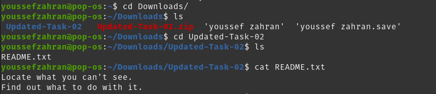
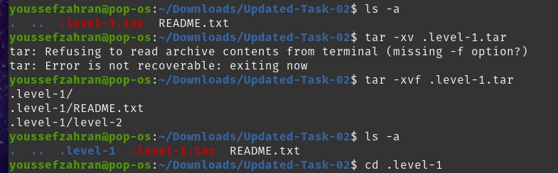
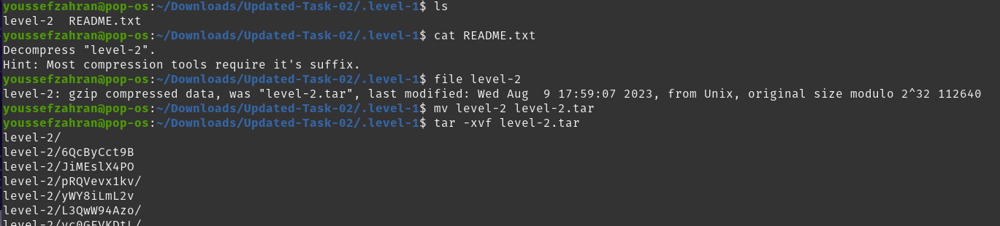
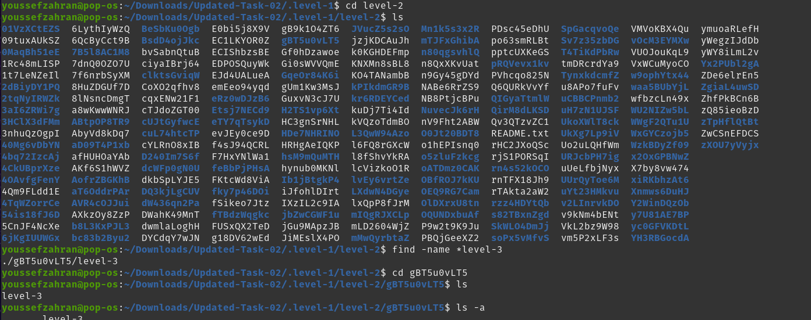
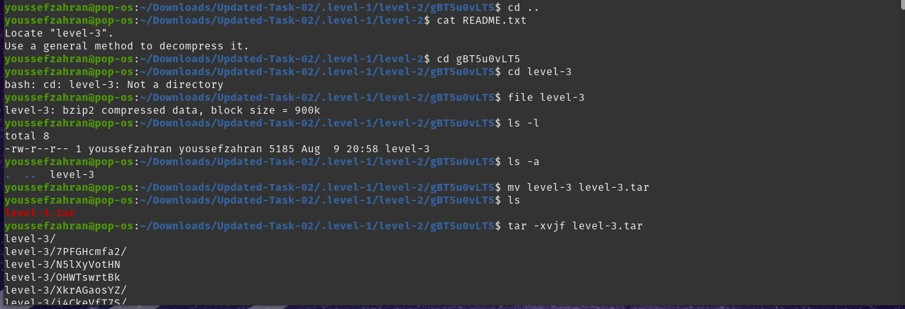
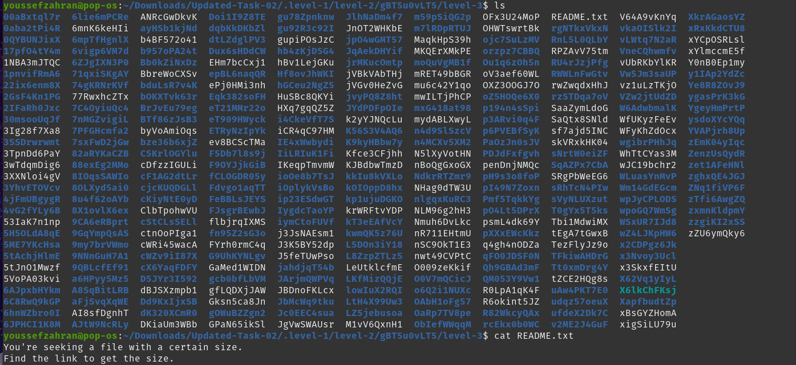
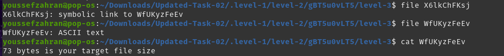
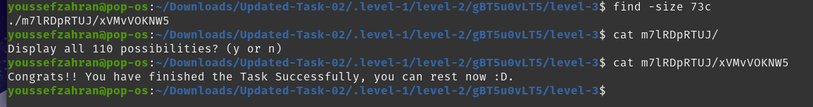

# Session 2 Task

## Step 1: Opening task directory and viewing contents

## Step 2: Listing and exetracting hidden compressed file

## Step 3: Entering .level-1 directory and decompressing level-2
(Note: using the v option lists all contents upon extracting/decompressing, thus the lines at the bottom)

## Step 4: Entering level-2 directory and finding level-3 directory 

## Step 5: Decompressing level-3 directory

## Step 6: Entering level-3 directory

## Step 7: listing level-3 contents and reading README file

## Step 8: Finding symbolic link, Finding file pointed to and reading it 

## Step 9: Finding file with designated size and reading its contents

