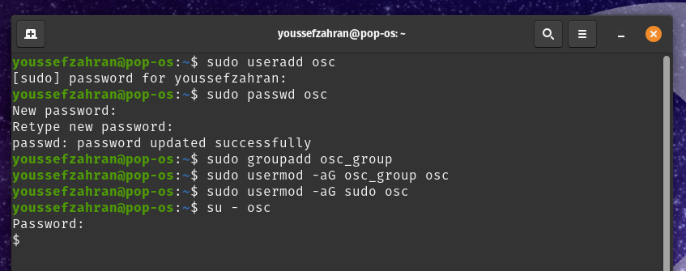
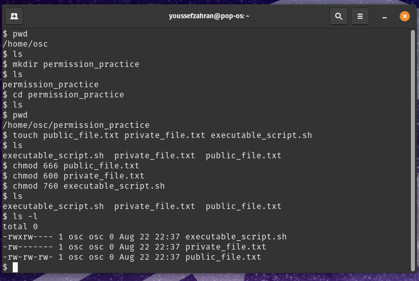
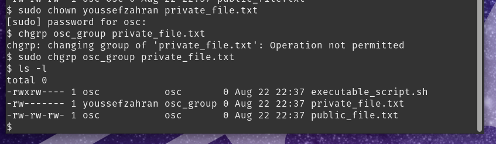
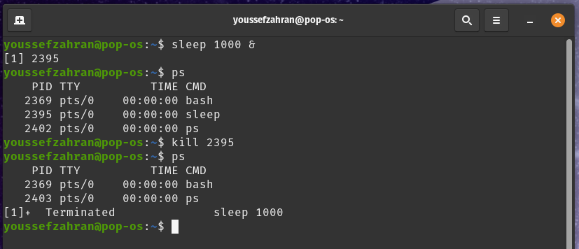
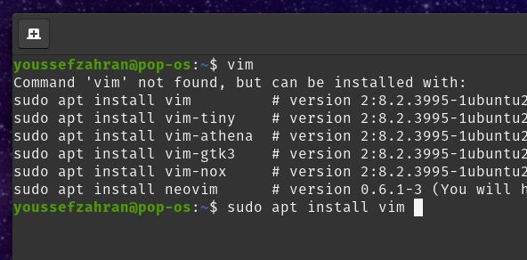
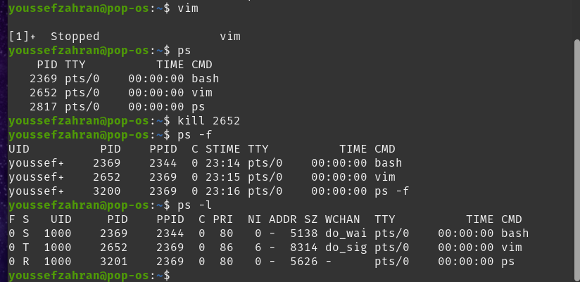
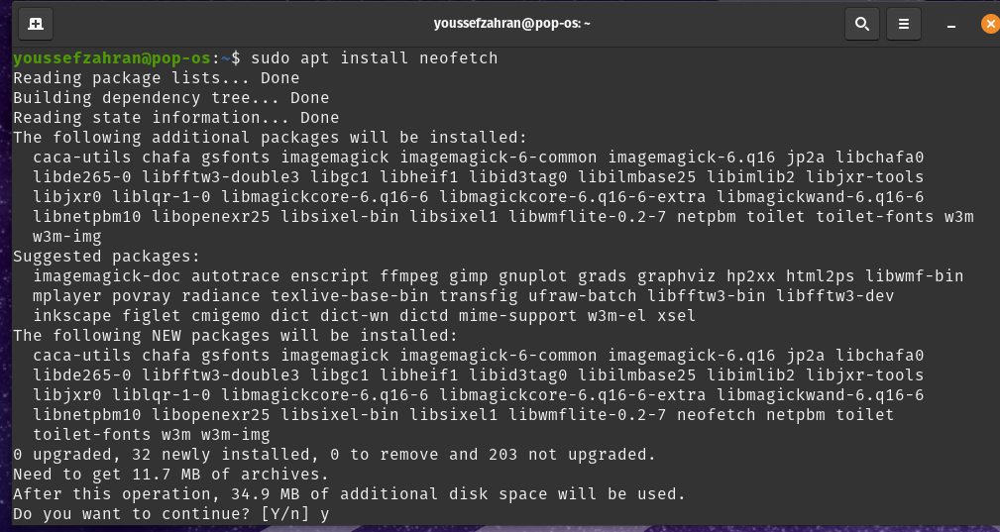
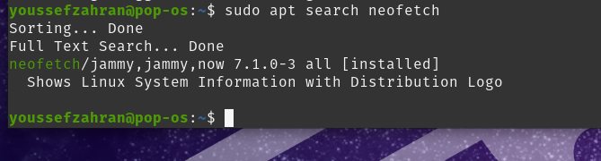

# Session 2 Task

## Step 1: Creating new user "osc" and new group "osc_group"

## Step 2: Making 3 files and changing permissions

## Step 3: Changing file ownership

## Step 4.1: Starting background process "sleep 1000" and killing it

## Step 4.2: Installing Vim

Note: vim was installed and was needed for the following step, so I installed it and included it as a step

## Step 4.3: Running Vim and killing it

Note: the sleep process was terminated previously so it no longer shows in ps, and and "T" shows under the S column for vim in the ps -l command, signifying it being terminated

## Step 5.1: Installing neofetch package 

## step 5.2: Checking if neofetch was installed successfully

Note: I used the search command to check whether neofetch was installed or not, shows "[installed]"

## Step 5.3: Uninstalling neofetch package (and checking if successfully uninstalled)

Note: Used search command again, no longer shows "[installed]" signifying no longer installed on system

  
